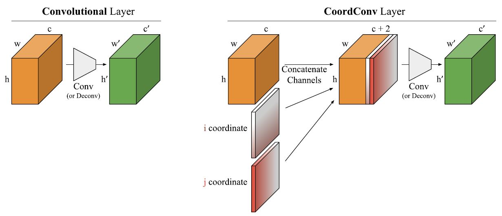
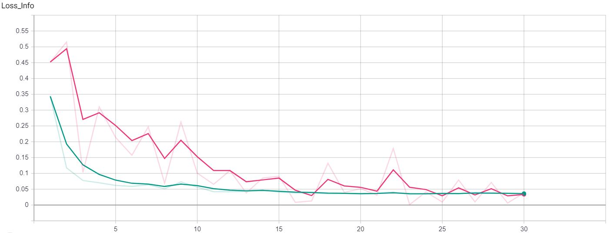
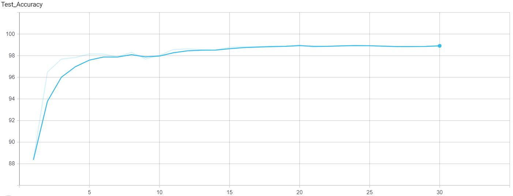
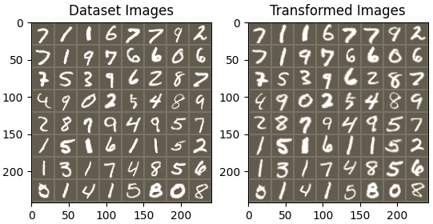
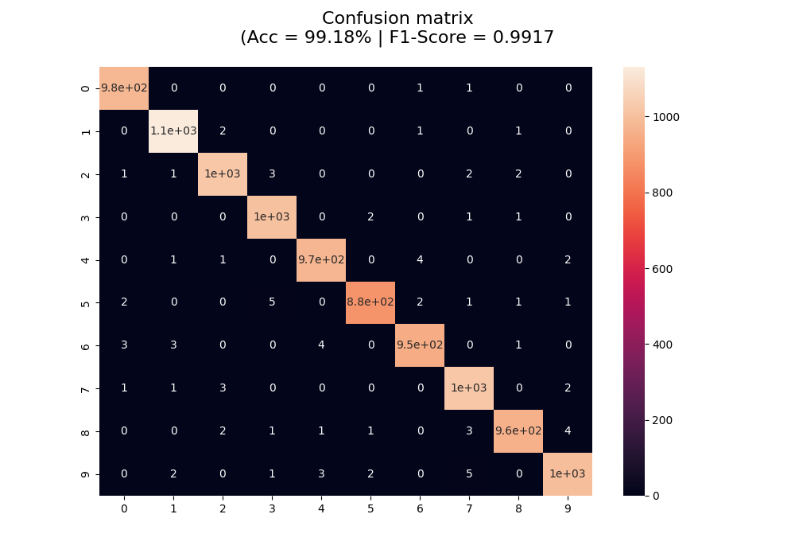
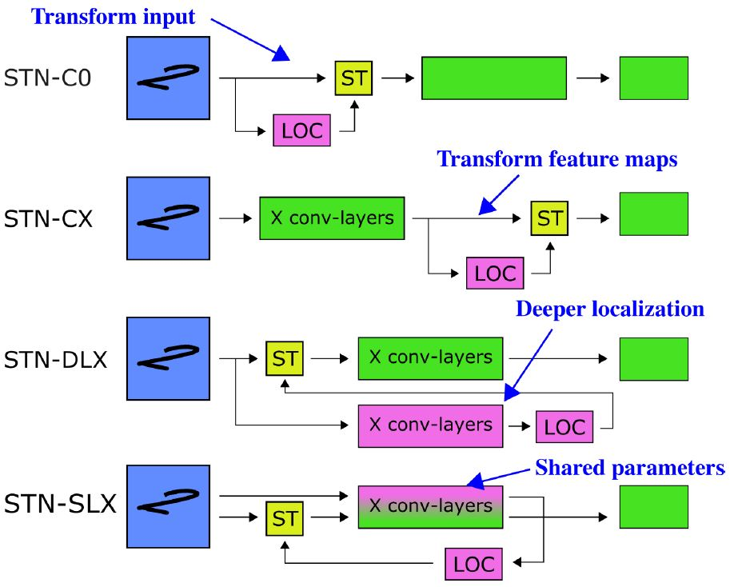

# STN_challenge

## Table of contents
* [Introduction](#introduction)
* [Setup](#setup)
* [Training](#training)
* [Research/Methods](#researchmethods)
* [Results](#results)
* [Future Work](#future-work)
* [References](#references)

## Introduction

The baseline code for the project is taken from the following PyTorch tutorial: https://pytorch.org/tutorials/intermediate/spatial_transformer_tutorial.html.
In it, one can learn how to augment your network using a visual attention mechanism called **spatial transformer networks** (STNs for short).
For more information please read [[1]](#1).

<p align="center">
 
</p>

STNs are a generalization of differentiable attention to any spatial transformation. They allow a neural network to learn
how to perform spatial transformations on the input image in order to enhance the geometric invariance of the model.
For example, it can crop a region of interest, scale and correct the orientation of an image. It can be a useful mechanism
because CNNs are not invariant to rotation and scale and more general affine transformations.

Taking into account the ideas from [[2]](#2)., the addition of a **CoordConv** layer into the STN mechanism is also investigated.
CoordConv allows networks to learn either complete translation invariance or varying degrees of translation dependence,
as required by the task. CoordConv solves the coordinate transform problem with perfect generalization and 150 faster 
with 10-100 times fewer parameters than convolution. See [[2]](#2). for more complete information on the topic.

<p align="center">
 
</p>

	
## Setup
To run this project, install it locally creating a Python virtual environment and install the Python packages included as requirements:

```
$ conda create --no-default-packages --name env_STNChallenge python=3.9
$ conda activate env_STNChallenge
$ pip install -r requirements.txt
```

## Training
To train the network on the MNIST dataset, run <code>spatial_transformer_tutorial.py</code>. Usage:

```
usage: spatial_transformer_tutorial.py [-h] [-ep EPOCHS] [-cv {coordconv2d,conv2d}]

MNIST - Spatial Transformer Network training pipeline

optional arguments:
  -h, --help            show this help message and exit
  -ep EPOCHS, --epochs EPOCHS
                        Number of epochs of the training loop
  -cv {coordconv2d,conv2d}, --conv-layer {coordconv2d,conv2d}
                        Type of convolutional layer used inside the localization network
```

## Research/Methods

A major code refactor has been done to the initial baseline for code clarity. **TensorboardX** has also been used in order 
to better visualize the training data such as train and test losses and model accuracy on the test set. This helped to 
check for model under/overfitting and generalization simply on your browser in realtime. To do that, once you have started
a training process, open a cmd/bash window and type (where <code>./runs</code> is the logging directory of the training events):

```
$ tensorboard --logdir ./runs
```

And then open in your browser http://localhost:6006/

<p align="center">
 
 
</p>

An **optimizer scheduler** was also included during training so as to lower the initial training rate by half. This 
yielded more stable training curves towards the second part of the process. Default number of **epochs** was fixed to **30**. 
Although momentum was added into the SGD optimizer with a value of 0.9 as well, it penalized convergence by not letting 
it get as low as without it, so it was again deleted.

Regarding the <code>grid_sampling</code> method inside the STN, the <code>padding_mode</code> parameter was changed to 
<code>"border"</code> to prevent the network from filling the zones outside of the grid with zeros. That was creating 
borders inside the sampled image that could affect classification accuracy.

<p align="center">
 
</p>

## Results

### Metrics

Relevant metrics were calculated to asses whether the addition of the CoordConv layer inside the localization network in the STN contributed to 
the improvement of the model. This metrics were taken from the best model in each training run for all the epochs, meaning
best as the highest accuracy on the test set. A total of 10 complete training loops were run (5 using the normal conv2d 
layer and 5 using the implemented coordconv2d layer). These metrics along with the loss information visualized thanks to 
TensorboardX also helped to decide about other minor modifications in the training process already commented in previous 
sections. For each run, a **confusion matrix** was calculated along with **test-set accuracy** percentage and **F1-Score**.
An example of this is the following image of the best model achieved:

<p align="center">
 
</p>

### Conv vs CoordConv

Check <code>./results</code> folder for more details. The table below gives the numerical results for all 10 run experiments:

Layer |  |  | **Conv** |  |  |  |  | **CoordConv** |  |  |
--- | :---: | :---: | :---: | :---: | :---: | :---: | :---: | :---: | :---: | :---:
Run | *#1* | *#2* | *#3* | *#4* | *#5* | *#1* | *#2* | *#3* | *#4* | *#5* | 
**Accuracy** [%] | 99.02  | 99.05 | 99.08 | 99.02 | 99.09 | 99.18 | 99.02 | 98.97 | 98.99 | 99.13
**F1-Score** | 0.9901 | 0.9904 | 0.9908 | 0.9901 | 0.9908 | 0.9917 | 0.9901 | 0.9897 | 0.9898 | 0.9913
**Mean** (*STD*) |  |  | **99.05** (*0.03*) |  |  |  |  | **99.06** (*0.09*) |  |  |

It cannot be concluded by the trials performed that the substitution of Conv for CoordConv layer inside the localization 
network in the STN enhances its functionality. It rather seems to be equivalent. However, best performing model was achieved
using CoordConv layer (#1 run of CoordConv -> **99.18% Accuracy** & **0.9917 F1-Score**)

## Future Work

After a bibliographic search on latest advancements on STNs, one article [[3]](#3). came up in which they proof that since STNs perform a
purely spatial transformation, they do not, in the general case, have the ability to align the feature maps of a transformed image
with those of its original. Therefore, they are unable to support invariance when transforming CNN feature maps. As a result,
they decide to investigate alternative STN architectures that make use of complex features.

They conclude that, while deeper localization networks are difficult to train, localization networks that share parameters
with the classification network remain stable as they grow deeper, which allows for higher classification accuracy on 
difficult datasets.

<p align="center">
 
</p>

The image above depicts four different ways of building STNs. *LOC* denotes the localization network, which predicts the
parameters of a transformation. *ST* denotes the spatial transformer, which takes these parameters and transforms an image
or feature map according to them. In **STN-C0**, the approach used in the experiments described in previous sections, 
the ST transforms the input image. In **STN-CX**, the ST transforms a feature map. **STN-DLX** transforms the input image, 
but makes use of deeper features by including copies of the first X convolutional layers in the localization network. 
Lastly, **STN-SLX** is similar to STN-DLX but shares parameters between the classification and localization networks. 
STN-SLX solves the theoretical problem, uses no more parameters than STN-CX, and like STN-CX, the localization network 
makes use of layers trained directly on the classification loss.

So, to sum up, a reasonable alternative would be to modify our current STN-C0 architecture and try STN-SLX architecture 
on classifying the MNIST dataset, given more time to do so. 

## References

* <a id="1">[1]</a> Spatial Transformer Networks (2016) -> https://arxiv.org/abs/1506.02025
* <a id="2">[2]</a> An intriguing failing of convolutional neural networks and the CoordConv solution (2018) -> https://arxiv.org/abs/1807.03247 
* <a id="3">[3]</a> Understanding when spatial transformer networks do not support invariance, and what to do about it (2021) -> https://arxiv.org/abs/2004.11678 